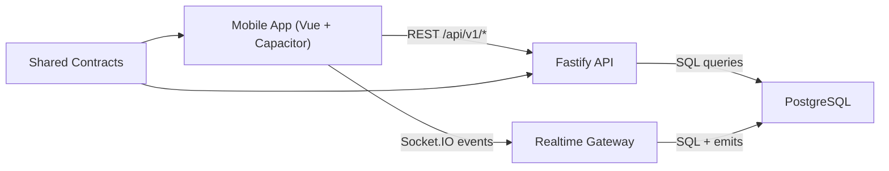

# Architecture in Plain English

## The 4 core pieces

1. `apps/mobile`
- The app UI users see.
- Handles login, chat screens, offline queue, and socket connection.

2. `services/api`
- The backend brain.
- Validates auth, checks permissions, saves messages, emits realtime events.

3. `packages/contracts`
- The shared rulebook (schemas/types).
- Keeps app and backend in sync.

4. `services/api` database layer (PostgreSQL)
- Stores users, invites, refresh tokens, chats, members, and messages.
- Final source of truth.

## How they talk to each other

## Typical user flow: send a message

1. User types message in mobile app.
2. App creates a `clientMessageId` and renders message optimistically.
3. App sends message to API (`POST /chats/:chatId/messages`) and/or socket event.
4. API verifies membership and writes to DB.
5. API emits:
- `message.new` to chat room
- `message.ack` to sender
6. App swaps temporary local message id with server id on ack/new event.

## Why this setup is stable

- Contract-first: app/backend changes are validated against the same schema.
- DB uniqueness (`chat_id + sender_id + client_message_id`) prevents duplicate messages.
- Token rotation keeps sessions safer and predictable.
- Offline queue + retry helps survive network/API instability.

## If one part breaks, what breaks?

- Contracts break -> app and backend drift (requests/events fail).
- Auth breaks -> most private routes and sockets fail.
- Dedup logic breaks -> duplicate or lost messages under reconnect/race.
- Reconnect logic breaks -> app appears "offline" even after server recovery.
